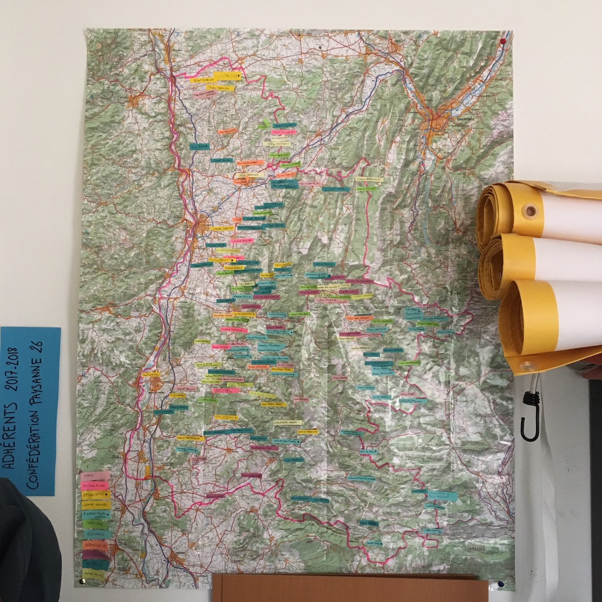

# Module MIN 306 • Promo 2019/2020

Module Développement Web (MIN 306) du « [Master innovation &amp; transformation numérique](https://www.sciencespo.fr/ecole-management-innovation/fr/formations/innovation-transformation-numerique.html) »

> La programmation web est un outil puissant et pérenne pour diffuser de l'information, s’exprimer et créer des interfaces interactives.
> Dans ce cours vous aurez une introduction pratique aux notions de programmation pour le web depuis le navigateur jusqu’au serveur.
> Le cours se concentrera sur des standards tels que HTML (structure), CSS (présentation) et JavaScript (interactions, structures de données) ainsi que des concepts sous-jacents (le parcours d'un octet sur le réseau, transit d'un fichier HTML jusqu'au pixel de l'écran, etc.).
> Il sera enseigné sous forme d’atelier à destination d’un public non technique en mettant en œuvre des méthodes agiles.
> Ce cours sera utilisé pour produire et publier le site web de votre data story (MIN302).

L'organisation du cours sera basé sur les [apprentissages de la promotion 2018/2019](https://github.com/oncletom/m2-min-2018) ([lire leur journal de bord](https://github.com/oncletom/m2-min-2018/blob/master/JOURNAL.md#jeudi-29-novembre)).

# Journal de bord

- Présentation des jeux de données, le vendredi 17 janvier 2020 (par Skype)
- [Jeudi 23 janvier 2020](JOURNAL.md#jeudi-23-janvier-2020) (après-midi)
- [Vendredi 24 janvier 2020](JOURNAL.md#vendredi-24-janvier-2020) (après-midi)
- [Jeudi 6 février 2020](JOURNAL.md#jeudi-6-février-2020) (après-midi)
- [Vendredi 7 février 2020](JOURNAL.md#vendredi-7-février-2020) (après-midi)
- [Jeudi 5 mars 2020](JOURNAL.md#jeudi-5-mars-2020) (après-midi)

# Ressources pour apprendre

- HTML
  - [Toutes les balises HTML](https://developer.mozilla.org/docs/Web/HTML/Element)
  - [balise `<a>`](https://developer.mozilla.org/docs/Web/HTML/Element/a)
- CSS
  - [Toutes les propriétés CSS](https://developer.mozilla.org/docs/Web/CSS/Reference)
  - [Un jeu avec les sélecteurs CSS](https://flukeout.github.io/)
  - [Transitionner d'un état vers un autre](https://developer.mozilla.org/docs/Web/CSS/transition)
  - [Animer un élément](https://developer.mozilla.org/docs/Web/CSS/animation)
  - [Transformer un élément](https://developer.mozilla.org/docs/Web/CSS/transform) (rotation, inclinaison, perspective 3D)
- DOM (lire et modifier des éléments HTML en écrivant du JavaScript)
  - [Element](https://developer.mozilla.org/docs/Web/API/Element)
  - [document](https://developer.mozilla.org/docs/Web/API/Document)
  - [querySelector()](https://developer.mozilla.org/docs/Web/API/Document/querySelector) et [querySelectorAll()](https://developer.mozilla.org/docs/Web/API/Document/querySelectorAll) pour trouver un ou des éléments dans la page (en utilisant un sélecteur CSS)
- SVG (dessiner des images responsives, stylables et animables en CSS)
  - [https://developer.mozilla.org/docs/Web/SVG](Documentation SVG)
  - [balise `<circle>`](https://developer.mozilla.org/docs/Web/SVG/Element/circle)
  - [balise `<text>`](https://developer.mozilla.org/docs/Web/SVG/Element/text)
  - [Réaliser des icônes en SVG](https://fvsch.com/svg-icons/)
- JavaScript et Node.js
  - [Livre Node.js par la pratique](https://oncletom.io/node.js/#chapitres)
  
# Ressources pour vos projets

- Coordonnées GPS de communes
  - Site laposte
  - [Découpage région/départements/communes](https://geo.api.gouv.fr/decoupage-administratif/regions)
  - [Géolocalisation à partir de Codes INSEE](https://geo.api.gouv.fr/adresse#csv-search)
  - [Fichier Codes INSEE géolocalisés](http://www.nosdonnees.fr/dataset/donnes-gographiques-des-communes-par-code-insee) (peut-être pas à jour)
  
  
# Questions / blocages

> (section remplie par les étudiant·es)

# Groupes projets

- [lebanese grocery shop](https://glitch.com/~lebanese-grocery-shop) - Par Publio, Telma et Marc
- [Datachef](https://glitch.com/~datachef) - par Arthur, Hadrien, Linus et Louis
- [Projet 🧟‍♂️](https://projet-deces.glitch.me) - Par Agathe, Jeanne, François et Alexis
- [Projet sur les tweets de Donald Trump](https://glitch.com/~donald-tweetrump) - Par Michele, Énora, Rodolphe, Ali
- [?](#) par ??

# Thématiques de travail au choix

Elles sont développées dans le document [`DATA.md`](DATA.md).

- [Stress hydrique du bassin hydrologique de la rivière Drôme](DATA.md#stress-hydrique-du-bassin-hydrologique-de-la-rivière-drôme)
- [Personnes décédées depuis 1970](DATA.md#personnes-décédées-depuis-1970)
- [Spéculation immobilière](DATA.md#spéculation-immobilière)
- [Genre et jouets](DATA.md#genre-et-jouets)
- [Cartographier l'agriculture paysanne dans la Drôme](DATA.md#cartographier-lagriculture-paysanne-dans-la-drôme)
- [Mettre en lien des porteur·ses de projet agricoles avec des paysan·nes déjà installés](DATA.md#mettre-en-lien-des-porteurses-de-projet-agricoles-avec-des-paysannes-déjà-installés)
- [Fréquentation d'un café-jeu associatif](DATA.md#fréquentation-dun-café-jeu-associatif)

